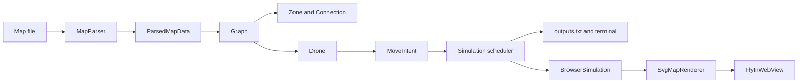
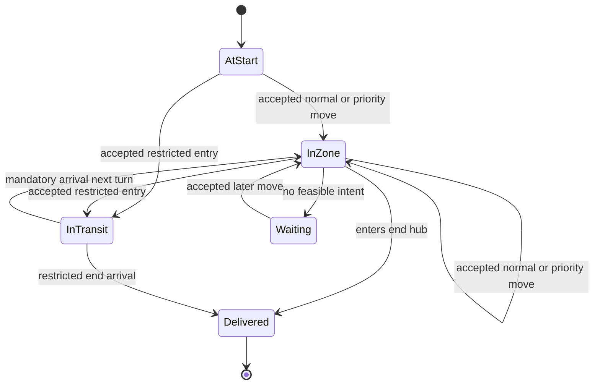
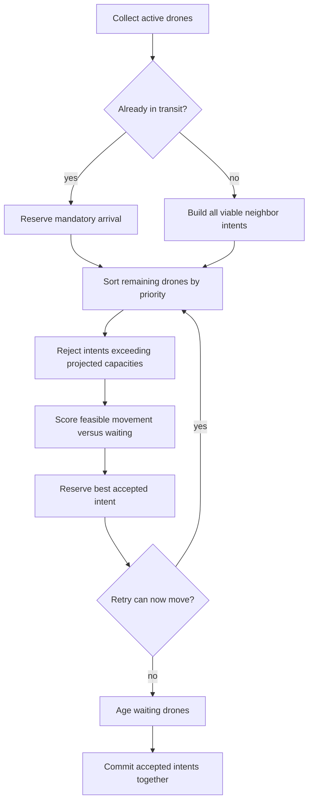

# Fly-in Implementation Guide

This document is written as a self-contained project wiki: it explains how the
implementation is assembled, which layer owns each rule, how every class
participates, and how a drone travels from the start hub to the end hub.

## Architecture at a Glance

The project separates input validation, domain state, routing, scheduling, and
presentation. The CLI and browser therefore execute the same simulation instead
of maintaining two versions of the business rules.



The source tree follows the same boundaries:

| File | Responsibility |
| --- | --- |
| `src/parser.py` | Reads map text and produces validated typed data. |
| `src/ZoneHub.py` | Defines the physical `Zone` and `Connection` entities. |
| `src/graph.py` | Builds the topology and implements weighted Dijkstra. |
| `src/drone.py` | Stores each drone's state and creates movement proposals. |
| `src/fly_in.py` | Runs turns, schedules the fleet, enforces capacities, and writes output. |
| `src/visualization.py` | Adapts domain state into snapshots, transitions, and safe SVG. |
| `src/web_app.py` | Builds NiceGUI controls and refreshes the browser view. |
| `tests/` | Verifies parsing, routing, turn rules, invariants, benchmarks, and presentation adapters. |

## Step-by-Step Implementation

### 1. Parse the map into typed data

`MapParser.parse_file()` is the first boundary. It removes comments and blank
lines while retaining original line numbers, requires `nb_drones` to be the
first declaration, splits optional metadata, and validates every declaration
before any domain object is created.

The parser rejects unknown keys, malformed or repeated metadata, non-positive
capacities, duplicate zones, duplicate undirected connections, self-links,
connections declared before their zones, invalid coordinates, and maps without
exactly one start and one end hub. Errors use the form `Line N: cause`, so an
invalid file never becomes a partially configured graph.

On success it returns `ParsedMapData`, containing `HubData` and
`ConnectionData`. These `TypedDict` structures form a small, typed contract
between parsing and graph construction. A `max_drones` value on the start or
end hub is accepted but normalized because those hubs have unlimited occupancy.

### 2. Build the object graph

`Graph.configure()` resets previous process state, creates one `Zone` for every
hub, creates each bidirectional `Connection`, and resolves the start and end
references. A connection registers itself in both endpoint adjacency lists;
there is no external graph library or hidden second topology.

`Zone.drones_in` stores drones physically occupying a zone.
`Connection.drones_in` stores drones spending the first half of a two-turn
restricted movement in transit. Start and end capacity is interpreted as
unlimited by the scheduler, while every interior zone and every connection has
an explicit positive capacity.

### 3. Calculate weighted shortest routes

`Graph._shortest_path_from()` implements Dijkstra with `heapq`. The heap stores
`(distance, sequence, zone)` so equally weighted entries do not require `Zone`
objects to be orderable. For each connection, the algorithm considers the
opposite endpoint and adds the **destination zone's** weight:

| Destination kind | Routing weight | Real movement duration |
| --- | ---: | ---: |
| `normal` | `1.0` | 1 turn |
| `priority` | `0.5` | 1 turn |
| `restricted` | `2.0` | 2 turns |
| `blocked` | skipped | cannot be entered |

The priority weight influences route selection only; simulation time is always
measured in whole turns. Once the end is reached, the `previous` mapping is
reconstructed into a forward route that excludes the current zone. Both the
cost and immutable route are cached by starting `Zone`, which is safe because
the topology and static weights do not change during a simulation.

`reachable_neighbors()` extends shortest-path lookup for fleet scheduling. It
returns every immediate non-blocked neighbor that can still reach the end,
ordered by its weighted remaining cost. This lets a drone use a viable
alternative route when the individually shortest corridor is congested.

### 4. Represent a drone as a state machine

Every `Drone` starts inside `graph.start_zone` with a generated ID (`D1`, `D2`,
and so on). It never moves itself speculatively. Instead, it returns an immutable
`MoveIntent` containing the drone, origin, destination, connection, and whether
the movement is a mandatory transit arrival.



The important state fields are:

- `current_zone`: the occupied zone, or `None` during restricted transit;
- `previous_zone`: used to discourage immediate backtracking;
- `in_transit` and `transit_destination`: the occupied connection and its
  compulsory destination;
- `wait_turns`: consecutive waits used by fairness and detour scoring;
- `finished_traversal`: removes a delivered drone from future scheduling.

`candidate_intents()` proposes every neighbor that can still reach the end.
`enter_transit()` moves a drone from its origin into a connection.
`complete_move()` handles an ordinary move or the second half of restricted
transit. Only these commit methods mutate physical occupancy.

### 5. Configure and run the simulation

`Simulation.configure()` connects the layers in a fixed order:

1. clear old simulation, graph, and class-registry state;
2. parse and validate the map;
3. configure the graph;
4. create the requested number of drones at the start hub;
5. clear `outputs.txt` and mark the simulation configured.

`start()` repeatedly calls `next_turn()` until `active_drones` is empty.
`next_turn()` plans first, commits accepted movements second, removes delivered
drones, records metrics, and appends exactly one subject-format line to the
output file. If active drones remain but no movement can be made, it raises an
explicit deadlock error instead of looping forever.

### 6. Plan one simultaneous turn

`Simulation._plan_turn()` is the fleet coordinator. It uses reservations rather
than sequential mutation so all accepted movements belong to the same logical
turn.



Mandatory restricted arrivals are reserved first. This is safe because the
destination capacity was reserved when the drone entered transit on the prior
turn. Other drones are ordered so interior drones generally clear constrained
zones before drones leave the unlimited start, drones with fewer alternatives
receive priority, and longer-waiting drones age forward.

For each drone, `_intent_is_feasible()` projects the result of already accepted
movements plus the candidate:

- connection usage cannot exceed `max_link_capacity`;
- interior destination occupancy cannot exceed `max_drones`;
- departures subtract occupancy in the same turn, allowing another drone to
  enter the zone immediately;
- restricted entries reserve both the connection now and destination capacity
  for the mandatory next-turn arrival;
- start and end hubs bypass zone-capacity checks.

Rejected drones are retried after other intents are reserved. This matters when
an accepted departure frees a zone that was full at the beginning of the turn.

### 7. Choose the most useful feasible movement

Feasibility answers whether a move is legal; `_intent_score()` estimates
whether it is useful. Lower is better. The score combines:

```text
destination weight + shortest remaining cost
+ projected congestion on up to 4 upcoming zones
+ projected congestion on up to 3 upcoming connections
+ temporary immediate-backtrack penalty
+ temporary interior cycle-detour penalty
```

The congestion terms are normalized by capacity and reduced with route depth,
so near bottlenecks matter more than distant ones. Immediate reversal starts
with a penalty of up to `4.5` and fades as the drone waits. Moving from an
interior zone to a neighbor that increases shortest remaining cost adds a `1.0`
detour penalty, preventing unnecessary laps around cycles.

The best feasible movement is also compared with `_wait_score()`:

```text
current shortest cost + 2.0 + min(wait_turns, 4) * 0.75
```

At first, waiting can be cheaper than an inefficient detour. As `wait_turns`
increases, waiting becomes less attractive, so sustained congestion eventually
allows the alternative. This balance distributes drones across parallel paths
without permanently starving one drone or eagerly sending it around a cycle.

This distinction is important when describing the "perfect path": Dijkstra
proves the minimum weighted path for one static starting zone, but minimizing
the completion turn of an entire capacity-constrained fleet is a larger
scheduling problem. The current global scheduler is a deterministic heuristic;
the invariant tests prove that its movements are valid, and the benchmark turn
counts demonstrate strong results, but it does not claim a mathematical global
optimum for every possible map.

### 8. Commit movements and produce output

After planning is complete, `_commit_movement()` applies each accepted intent.
A normal or priority movement transfers the drone directly between zones. A
restricted entry removes it from the origin and places it on the connection;
the next turn removes it from the connection and places it at the reserved
destination.

`_format_movement()` prints `D<ID>-<zone>` for direct moves and restricted
arrivals. The first restricted turn prints `D<ID>-<connection>`, making the
two-turn physical state observable. Waiting drones are omitted. Terminal-only
metrics are printed after completion and never contaminate `outputs.txt`.

### 9. Add visualization without duplicating business rules

`BrowserSimulation` owns a normal `Simulation` and calls only its public
`configure()` and `next_turn()` lifecycle. Before and after each turn it records
`DroneLocation` values and derives immutable `DroneTransition` records. Its
`SimulationSnapshot` gives the UI read-only counters without letting NiceGUI
approve moves or change capacities.

`SvgMapRenderer` reads the configured graph and produces escaped SVG markup. Its
adaptive layout preserves the subject coordinate relationships, guarantees a
minimum distance per coordinate step, and expands the SVG canvas for large
topologies instead of squeezing every map into a fixed rectangle. It uses
distinct shapes for zone kinds, displays occupancy, anchors identifiable drone
clusters to their physical location, and assigns parallel animation lanes to
simultaneous moves. It shows at most 16 markers at one location and reports
overflow as `+N`; dense fitted views use a compact occupancy badge until zoom
makes the individual markers readable, while the manifest always contains
every drone.

`FlyInWebView` builds the NiceGUI page, loads a map as soon as its selector value
changes, maps playback buttons to the adapter, controls automatic playback with
a timer, and refreshes labels, tables, history, and SVG from one current domain
snapshot. A selection change first pauses playback, then configures the map,
clears history, refreshes the complete controller, and resets the camera. The
desktop controller gives the map selector, playback actions, status pills, and
viewport actions larger minimum dimensions, while narrower breakpoints hide
optional metrics or wrap controls without changing the SVG simulation. The
JavaScript viewport reads the renderer's dynamic
base canvas and changes one shared SVG `viewBox` for zoom and pan, preserving
the alignment of connections, zones, drone anchors, labels, and animations.
Zoom controls run as deferred browser callbacks. At each zoom, local drone
orbits are recalculated from their unchanged location anchor. Partial scale
compensation lets drone glyphs and their clearance grow gradually with zoom,
without altering route geometry. The browser layer never implements
pathfinding or scheduling.

## Class and Data Contract Reference

| Class or contract | Main state | Role and important operations |
| --- | --- | --- |
| `HubData` | name, kind, coordinates, endpoint flags, color, capacity | Typed parser-to-graph zone contract. |
| `ConnectionData` | endpoint names and link capacity | Typed parser-to-graph connection contract. |
| `ParsedMapData` | drone count, hubs, connections | Complete validated parser result. |
| `MapParser` | source path and line-aware parsing state | `parse_file()` validates the complete input atomically. |
| `Zone` | metadata, adjacency, weight, `drones_in` | Represents one vertex and its physical occupancy. |
| `Connection` | two endpoints, capacity, `drones_in` | Represents one undirected edge and transit occupancy. |
| `Graph` | zone dictionary, connection list, endpoints, path cache | Builds topology, finds adjacency, runs and caches Dijkstra. |
| `MoveIntent` | drone, origin, destination, connection, arrival flag | Immutable proposal separating planning from mutation. |
| `Drone` | identity, route state, physical location, wait state | Produces candidate intents and commits accepted movement. |
| `Simulation` | graph, fleet, active list, turn history, metrics | Owns lifecycle, simultaneous scheduling, validation, output, and deadlock detection. |
| `DroneLocation` | location kind and name | Immutable visual reference to a zone or connection. |
| `DroneTransition` | ID, origin, destination, status | Describes one observed movement for animation and tables. |
| `SimulationSnapshot` | counters, status, last movement | Immutable summary consumed by browser controls. |
| `BrowserSimulation` | available maps, selected simulation, latest transitions | Presentation adapter around the real simulation lifecycle. |
| `SvgMapRenderer` | adaptive spacing and visual defaults | Converts domain state to safe, accessible, map-sized SVG markup. |
| `FlyInWebView` | adapter, renderer, NiceGUI elements, timer | Coordinates one browser client's controls and refresh cycle. |

The class-level registries in `Zone`, `Connection`, and `Drone` are reset during
configuration. They support the current local single-simulation workflow; a
multi-user server would need simulation-scoped registries before independent
concurrent sessions could be guaranteed.

## Complexity

Let `V` be zones, `E` connections, `D` active drones, and `degree` the number of
candidate neighbors inspected per drone.

- one uncached Dijkstra lookup costs `O((V + E) log V)` time;
- path reconstruction costs `O(V)` in the longest simple route;
- cached shortest paths may occupy `O(V^2)` memory in the worst case;
- live topology and fleet state occupy `O(V + E + D)` memory;
- a typical scheduling pass costs approximately `O(D^2 * degree)` because
  capacity projections inspect accepted intents;
- retry-heavy scheduling can reach `O(D^3 * degree)` in the current
  implementation.

## How to Validate or Extend the Project

Use `make test` to check behavioral tests and benchmark invariants, `make lint`
for Flake8 and Mypy, and `make run MAP=<file>` to verify the evaluator-facing
flow. When changing the scheduler, test not only the number of turns but also
per-turn zone occupancy, connection usage, mandatory restricted arrivals,
completion, and deadlock behavior.

Safe extension boundaries are intentionally narrow:

- add parser syntax in `MapParser`, then extend its typed contracts and parser
  tests;
- add static routing rules in `Graph` and dynamic fleet policy in `Simulation`;
- add drone lifecycle state in `Drone`, keeping proposals immutable until
  accepted;
- expose new read-only UI data through `SimulationSnapshot`;
- change rendering in `SvgMapRenderer` and interaction/layout in
  `FlyInWebView` without moving domain decisions into the browser.
